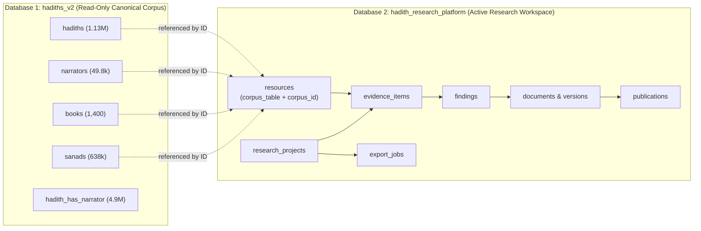

# 🔬 Hadith Research Platform — Dedicated Database ER Diagram & Architecture
**Database:** `hadith_research_platform` (PostgreSQL)  
**Parent Corpus Database:** `hadiths_v2` (Linked via Typed Corpus References)  
**Standard:** Open Hadith Research Platform SRS (v0.2 / R1)  
**Total Tables:** 35  

---

## 🏗️ Architectural Topology: Two Decoupled Databases



---

## 📊 Complete Mermaid ER Diagram (`hadith_research_platform`)

```mermaid
erDiagram

    %% ========================================================
    %% 1. IDENTITY, PROFILES & APPLICATIONS
    %% ========================================================
    users ||--o{ researcher_profiles : "has_profile"
    users ||--o{ researcher_applications : "applies_via"
    users ||--o{ user_sessions : "maintains_session"
    users ||--o{ research_projects : "owns_project"
    users ||--o{ project_memberships : "participates_as"
    users ||--o{ library_items : "favourites_in_library"
    users ||--o{ annotations : "authors_annotation"

    %% ========================================================
    %% 2. PROJECTS, MEMBERSHIP & ATTACHMENTS
    %% ========================================================
    research_projects ||--o{ project_memberships : "has_members"
    research_projects ||--o{ project_resources : "includes_resource"
    research_projects ||--o{ attachments : "stores_file"
    research_projects ||--o{ result_sets : "preserves_result_set"
    research_projects ||--o{ evidence_items : "contains_evidence"
    research_projects ||--o{ analysis_runs : "records_analysis"
    research_projects ||--o{ findings : "establishes_finding"
    research_projects ||--o{ documents : "authors_document"
    research_projects ||--o{ discussion_threads : "hosts_discussion"
    research_projects ||--o{ tasks : "assigns_task"
    research_projects ||--o{ announcements : "projects_announcement"
    research_projects ||--o{ submissions : "submits_package"
    research_projects ||--o{ publications : "publishes_output"

    %% ========================================================
    %% 3. RESOURCES, LIBRARY & COLLECTIONS
    %% ========================================================
    resources ||--o{ library_items : "saved_in_library"
    resources ||--o{ collection_resources : "grouped_in_collection"
    resource_collections ||--o{ collection_resources : "contains_resource"
    resources ||--o{ project_resources : "associated_with_project"
    resources ||--o{ evidence_items : "extracted_from"
    resources ||--o{ citations : "cited_as_source"

    %% ========================================================
    %% 4. SEARCHES & RESULT SETS
    %% ========================================================
    saved_queries ||--o{ search_runs : "executed_in"
    search_runs ||--o{ result_sets : "generates_set"
    result_sets ||--o{ result_set_members : "indexes_member"

    %% ========================================================
    %% 5. EVIDENCE, ARGUMENTS & WRITING
    %% ========================================================
    evidence_items ||--o{ finding_evidence : "evidential_role"
    findings ||--o{ finding_evidence : "supported_by"
    documents ||--o{ document_versions : "revised_as"
    document_versions ||--o{ citations : "contains_citation"
    evidence_items ||--o{ citations : "anchors_citation"

    %% ========================================================
    %% 6. COLLABORATION, DISCUSSIONS & TASKS
    %% ========================================================
    discussion_threads ||--o{ comments : "thread_messages"

    %% ========================================================
    %% 7. EDITORIAL & PEER REVIEW PUBLICATION
    %% ========================================================
    submissions ||--o{ review_assignments : "assigned_reviewers"
    submissions ||--o{ editorial_decisions : "editorial_verdict"
    submissions ||--o{ publications : "released_as_public"


    %% ========================================================
    %% ENTITY ATTRIBUTE DEFINITIONS
    %% ========================================================

    users {
        bigint id PK
        varchar email UK
        varchar password_hash
        varchar display_name
        varchar preferred_language
        varchar status
        timestamp created_at
        timestamp updated_at
    }

    researcher_profiles {
        bigint id PK
        bigint user_id FK
        varchar affiliation
        text biography
        text_array research_interests
        boolean is_public
        jsonb public_fields
        timestamp created_at
        timestamp updated_at
    }

    researcher_applications {
        bigint id PK
        bigint user_id FK
        varchar status
        text research_statement
        text sample_publications
        text decision_reason
        bigint decided_by FK
        timestamp decided_at
        timestamp created_at
    }

    research_projects {
        bigint id PK
        bigint owner_id FK
        varchar title
        text question
        text scope
        varchar primary_language
        varchar stage
        boolean is_archived
        boolean is_deleted
        timestamp recovery_deadline
        timestamp created_at
        timestamp updated_at
    }

    project_memberships {
        bigint id PK
        bigint project_id FK
        bigint user_id FK
        varchar role
        varchar status
        bigint invited_by FK
        timestamp accepted_at
        timestamp revoked_at
    }

    resources {
        bigint id PK
        varchar resource_type
        varchar corpus_table
        bigint corpus_id
        varchar title
        varchar author
        jsonb source_metadata
        varchar rights_status
        text provenance
        timestamp created_at
    }

    library_items {
        bigint id PK
        bigint user_id FK
        bigint resource_id FK
        boolean is_favourite
        text personal_notes
        timestamp created_at
    }

    resource_collections {
        bigint id PK
        varchar owner_type
        bigint owner_id
        varchar name
        text description
        timestamp created_at
    }

    project_resources {
        bigint id PK
        bigint project_id FK
        bigint resource_id FK
        bigint added_by FK
        text inclusion_rationale
        text_array tags
        timestamp created_at
    }

    saved_queries {
        bigint id PK
        varchar owner_type
        bigint owner_id
        varchar name
        text query_text
        varchar search_mode
        jsonb filter_criteria
        timestamp created_at
    }

    search_runs {
        bigint id PK
        bigint saved_query_id FK
        varchar corpus_version
        integer match_count
        varchar status
        integer execution_duration_ms
        timestamp created_at
    }

    result_sets {
        bigint id PK
        bigint project_id FK
        bigint search_run_id FK
        varchar name
        boolean is_frozen
        integer total_count
        timestamp created_at
    }

    result_set_members {
        bigint id PK
        bigint result_set_id FK
        varchar resource_type
        bigint corpus_id
        integer ordinal_position
        jsonb snapshot_data
        timestamp created_at
    }

    evidence_items {
        bigint id PK
        bigint project_id FK
        bigint resource_id FK
        text captured_text
        varchar locator
        varchar source_version
        varchar content_hash
        varchar state
        text exclusion_reason
        bigint collector_id FK
        timestamp created_at
    }

    annotations {
        bigint id PK
        bigint author_id FK
        varchar target_type
        bigint target_id
        integer span_start
        integer span_end
        varchar annotation_kind
        varchar visibility
        text body
        timestamp created_at
    }

    analysis_runs {
        bigint id PK
        bigint project_id FK
        varchar analysis_type
        jsonb input_params
        jsonb output_data
        integer version_number
        bigint created_by FK
        timestamp created_at
    }

    findings {
        bigint id PK
        bigint project_id FK
        text question
        text claim
        text reasoning
        text limitations
        varchar status
        timestamp created_at
        timestamp updated_at
    }

    finding_evidence {
        bigint id PK
        bigint finding_id FK
        bigint evidence_id FK
        varchar relation_type
        text interpretation
        timestamp created_at
    }

    documents {
        bigint id PK
        bigint project_id FK
        varchar title
        varchar document_type
        varchar language
        timestamp created_at
        timestamp updated_at
    }

    document_versions {
        bigint id PK
        bigint document_id FK
        integer version_number
        text content
        bigint author_id FK
        text change_summary
        timestamp created_at
    }

    citations {
        bigint id PK
        bigint document_version_id FK
        bigint evidence_id FK
        bigint resource_id FK
        varchar locator
        varchar citation_type
        text formatted_citation
        timestamp created_at
    }

    discussion_threads {
        bigint id PK
        bigint project_id FK
        varchar target_type
        bigint target_id
        varchar title
        boolean is_resolved
        timestamp created_at
    }

    comments {
        bigint id PK
        bigint thread_id FK
        bigint author_id FK
        text content
        timestamp created_at
    }

    tasks {
        bigint id PK
        bigint project_id FK
        varchar title
        text description
        bigint assignee_id FK
        date due_date
        varchar status
        text blocking_reason
        timestamp completed_at
        timestamp created_at
    }

    announcements {
        bigint id PK
        bigint project_id FK
        varchar public_slug UK
        varchar title
        text summary
        varchar research_stage
        text_array keywords
        varchar status
        timestamp published_at
        timestamp created_at
    }

    submissions {
        bigint id PK
        bigint project_id FK
        integer version_number
        varchar title
        text abstract
        jsonb frozen_package
        varchar package_checksum
        varchar status
        bigint submitted_by FK
        timestamp submitted_at
        timestamp created_at
    }

    review_assignments {
        bigint id PK
        bigint submission_id FK
        bigint reviewer_id FK
        varchar recommendation
        text reviewer_notes
        timestamp completed_at
        timestamp created_at
    }

    editorial_decisions {
        bigint id PK
        bigint submission_id FK
        bigint editor_id FK
        varchar decision
        text decision_notes
        timestamp decided_at
    }

    publications {
        bigint id PK
        bigint project_id FK
        bigint submission_id FK
        varchar public_slug UK
        varchar title
        text abstract
        jsonb published_content
        varchar version_string
        varchar status
        bigint released_by FK
        timestamp released_at
        timestamp created_at
    }

    export_jobs {
        bigint id PK
        bigint requester_id FK
        varchar scope
        bigint target_id
        varchar format
        varchar status
        text download_url
        bigint file_size
        varchar checksum
        timestamp expires_at
        timestamp completed_at
        timestamp created_at
    }

    audit_events {
        bigint id PK
        bigint actor_id FK
        varchar action
        varchar object_type
        bigint object_id
        jsonb details
        varchar ip_address
        timestamp created_at
    }

    corpus_correction_proposals {
        bigint id PK
        bigint researcher_id FK
        varchar corpus_table
        bigint corpus_id
        text current_value
        text proposed_value
        text evidence_notes
        varchar status
        bigint decided_by FK
        timestamp decided_at
        timestamp created_at
    }
```



---

## 🔗 How it Links to `hadiths_v2` without Coupling

The research platform accesses classical data through the **`resources`** entity:
```sql
SELECT * FROM resources 
WHERE corpus_table = 'hadiths' AND corpus_id = 4008;
```
* **Read-only Isolation:** The scholar's notes, hypotheses, and tags live entirely inside `hadith_research_platform` (`project_resources`, `evidence_items`, `annotations`).
* **Canonical Safety:** No research activity can ever mutate or delete rows in `hadiths_v2`.
* **Corpus Proposals:** If a scholar discovers an erratum in a Hadith manuscript, it is submitted via `corpus_correction_proposals` to the institutional corpus editors rather than silently changing the live database.
