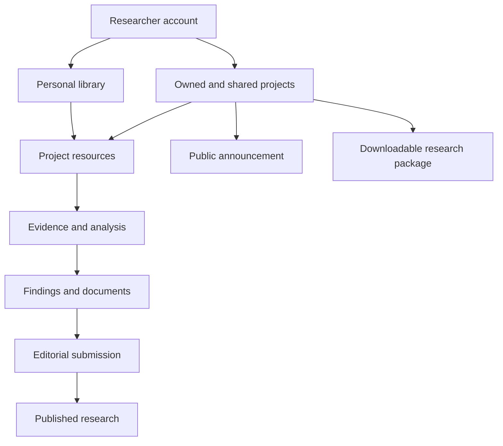
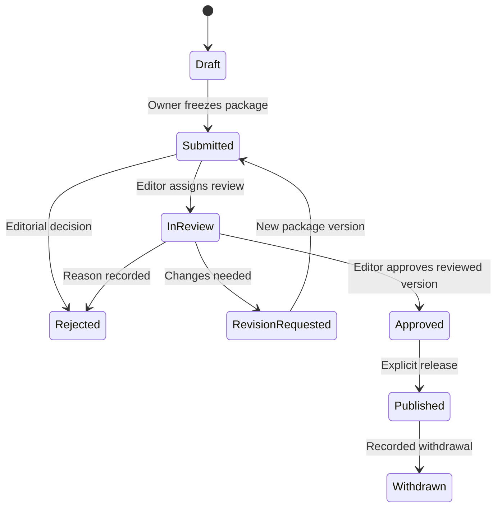

# Open Hadith Research Platform — Detailed Development Requirements

**Version:** 0.2 — revised development baseline (supersedes v0.1, kept unchanged as `Open_Hadith_Research_Platform_Requirements_v0.1.md`)  
**Prepared:** 4 October 2026 (v0.1); revised 4 October 2026 (v0.2)  
**Product:** Research workspace and public research publishing within Open Hadith  
**Audience:** Product owner, Hadith scholars, designers, software engineers, database engineers, editors, and QA  
**Status:** Confirmed product decisions plus explicitly identified proposed implementation defaults. This document specifies future behaviour; it does not assert that the prototype already implements it.

## Navigation

- [1. Purpose and confirmed decisions](#1-purpose-and-product-outcome)
- [2. Scope and releases](#2-scope-and-delivery-boundaries)
- [3. Roles and permissions](#3-users-ownership-and-permissions)
- [4. Screens and navigation](#4-information-architecture-and-principal-screens)
- [5. Domain concepts](#5-domain-concepts-and-relationships)
- [6. Functional requirements and acceptance criteria](#6-functional-requirements-and-acceptance-criteria)
- [7. Workflows and business rules](#7-workflow-specifications-and-business-rules)
- [8. Corpus integration and data gates](#8-existing-corpus-integration-and-r0-data-gates)
- [9. Proposed data model](#9-proposed-research-layer-data-model)
- [10. Services and interface contracts](#10-service-boundaries-and-interface-contracts)
- [11. Research journeys](#11-detailed-research-journeys)
- [12. Visibility, retention, and failures](#12-visibility-retention-rights-and-failure-handling)
- [13. Nonfunctional requirements](#13-nonfunctional-requirements)
- [14. Acceptance tests](#14-end-to-end-acceptance-and-verification-plan)
- [15. Release plan and backlog](#15-release-plan-and-implementation-order)
- [16. User-needs traceability](#16-traceability-to-confirmed-user-needs)
- [17. Remaining decisions](#17-decisions-still-required-before-implementation-commitments)
- [18. Development handoff](#18-development-handoff-and-definition-of-ready)
- [19. Terminology](#19-terminology)

**How to use this document:** Begin with confirmed decisions and proposed defaults, then use requirement IDs in tickets, designs, commits, and QA evidence. Each functional row states a mandatory capability for its assigned release and a minimum acceptance criterion. Quantitative targets and policy defaults remain proposed until the responsible owner accepts them.

## Change log — v0.1 to v0.2

| # | Change | Where |
|---|---|---|
| 1 | Release R1 split into **R1a** (personal research), **R1b** (collaboration and announcements), **R1c** (formal publication); each has its own gate | §2.3, §14.4, §15.2, release column of §6 |
| 2 | Formal publication is gated on a staffed editorial process; announcements are the only public output until then | A12, §15.2, §17 |
| 3 | R1 editor reduced to structured Markdown with preview; WYSIWYG moved to R2 (new WRT-10) | WRT-03, WRT-10, A13 |
| 4 | File uploads (LIB-04) and full-book downloads deferred until the rights policy exists; rights (DATA-06) and hosting became R0 exit criteria | A11, LIB-04, §12.3, §15.1, §17 |
| 5 | Performance and availability numbers marked provisional until the R0 benchmark and hosting decision | §13, NFR-02/04/06/07 |
| 6 | Single policy module for authorization, delivered in R0/R1a (new SEC-01, SEC-02, AT-25) | §6.13, §14.2, §15.1 |
| 7 | Small gaps closed: one announcement page per project, TOTP for MFA, split audit retention, abuse and rate limits, input files folder | §7.4, ACC-08, §12.2, ADM-03, §1.2 |
| 8 | Release gate assignment of acceptance tests; backlog gains a release column; R1a MVP extract and CSV backlog added | §14.4, §15.5, `R1a_MVP.md`, `Backlog.csv` |

## 1. Purpose and product outcome

The platform shall give each approved researcher a personal account containing their own resources, saved searches, research projects, notifications, and downloadable work. A researcher shall be able to own and participate in multiple projects. Each project shall have a separate research workspace containing its question, scope, resources, evidence, analyses, collaborators, discussions, findings, and outputs.

The workspace shall connect to the existing Hadith corpus so that researchers can move from a source passage to its report, chains, narrators, related passages, and attributed scholarly assessments. Researchers shall be able to announce a project publicly, collaborate privately, submit formal findings for editorial review, publish approved findings on the website, and download their authorized research material when needed.

Success means that a researcher can complete an evidence-based investigation from collection through analysis, writing, review, publication, and export without losing provenance or confusing personal interpretation with the official corpus.

### 1.1 Confirmed decisions

| Decision | Confirmed requirement |
|---|---|
| C01 | Researchers log in to individual accounts containing their research work. |
| C02 | One account supports multiple owned and shared projects; each project has its own research space. |
| C03 | Researchers save favourite resources, books, references, searches, and research-specific material. |
| C04 | The platform supports research collaboration. |
| C05 | Researchers can announce research from their projects and publish findings on the website. |
| C06 | Researchers can download their research and associated authorized resources when needed. |
| C07 | Anyone may apply for an account; researcher access requires administrative approval. |
| C08 | Project announcements can be published directly by an authorized researcher; formal research findings require editorial approval. |
| C09 | Requirements cover the complete intended platform with phased delivery. |

C01–C06 were agreed in the preceding discussion. C07–C09 were selected in the requirements clarification. Detailed permissions, numerical limits, formats, and operational targets below are proposed defaults unless explicitly covered by these decisions.

### 1.2 Inputs and evidential limits

- The user's supplied `hadiths_v2` ER diagram and table descriptions are the basis for corpus integration. They have not been independently verified against a live database in this task.
- The Research Projects prototype was previously inspected at [Research Projects](https://openhadith.github.io/ui-design/design/Research%20Projects.dc.html). It supplies visual context, not a complete functional specification.
- The preceding research catalogue supplies examples of investigations. This document does not require every proposed research paper to become a separate feature.
- Reported volumes of approximately 1.13 million records and 4.9 million transmission edges are planning inputs. Release 0 shall establish actual units, counts, coverage, and data quality.
- No database credentials or connection secrets belong in this document or implementation fixtures.
- Source inputs (the `hadiths_v2` ER diagram, table descriptions, and prototype captures) are to be stored in the `inputs/` folder next to this document and cited by filename, so statements here can be checked against them.

### 1.3 Proposed defaults and matters to validate

| ID | Proposed default | Validation owner |
|---|---|---|
| A01 | Private personal resources and project workspaces by default; only explicit announcement/publication projections are public | Product owner |
| A02 | Approval applies to researcher status; public reading requires no account | Product owner |
| A03 | All research collaborators have approved accounts; invitation alone does not bypass approval | Product owner |
| A04 | Sorani and Arabic UI at first release; English UI in Release 2; content may use all three from Release 1 | Product/localization leads |
| A05 | Project owners authorize announcements and formal submission; editors authorize formal publication | Product/editorial leads |
| A06 | Assigned publication reviewers see the submitted package, not all private project material | Editorial lead |
| A07 | One Open Hadith organization, responsive web application, background workers, and managed file storage | Technical lead |
| A08 | No billing, marketplace, institution tenancy, or public project-discussion forum in the baseline | Product owner |
| A09 | No external AI provider receives private content without a separate explicit product consent design | Product/technical leads |
| A10 | Soft-deletion recovery 30 days; temporary exports expire after 7 days; operational targets in Section 13 are provisional until the R0 benchmark and hosting decision | Operations/product leads |
| A11 | No file uploads and no full-book downloads in R1a–R1c: metadata, citations, and permitted excerpts only, until the DATA-06 rights policy is approved (uploads then enter at R2) | Product owner / rights lead |
| A12 | Formal publication (R1c) stays disabled until at least two eligible editors exist and the editorial policy is approved; announcements (R1b) are the only public output until then | Editorial lead |
| A13 | The R1a writing editor is structured Markdown with live preview and per-block text direction; WYSIWYG editing enters at R2 | Technical lead |

These defaults allow design and backlog preparation to proceed. Items affecting data fidelity and permissions are release gates, not details to infer silently during implementation.

## 2. Scope and delivery boundaries

### 2.1 In scope

Accounts and approval; profiles; My Library; multiple projects; resources and saved searches; source-linked evidence; manual and assisted comparisons; collaboration; review; announcements; public findings; citations; version history; exports; corpus adapters; administration; accessibility; localization; and reliability.

### 2.2 Outside the baseline

Automated authoritative Hadith grading; automatic canonical corpus changes from research conclusions; unrestricted redistribution of all books; a full journal submission business; payments; native mobile apps; offline synchronization; execution of arbitrary uploaded code; universal OCR/HTR; guaranteed reconstruction of lost material; and a word processor matching all desktop publishing features.

Later integration may extend these areas through separately approved requirements. AI assistance is optional and is not a dependency for the core research journey.

### 2.3 Release notation

- **R0 — Foundation gate:** schema validation, corpus semantics, authorization design, source identity, and migration planning.
- **R1a — Personal research core:** accounts and approval, library, multiple private projects, repeatable searches and result sets, evidence, annotations, basic comparisons, structured writing, and personal/project downloads. Single-owner projects.
- **R1b — Collaboration and public announcements:** project membership and roles, scoped discussion, tasks, notifications, and direct project announcements.
- **R1c — Formal publication:** submission packages, editorial review, approved immutable releases, public findings pages, and corrections/withdrawal. Starts only when A12 is satisfied.
- **R2 — Advanced research:** richer isnād/matn analysis, investigation templates, enhanced criticism analysis, reproducible datasets, and additional publication formats.
- **R3 — Assisted discovery:** evaluated automation, optional AI, advanced visualizations, and documented interoperability.

Numbered functional requirements use **shall** and are mandatory for their assigned release. An R2/R3 requirement must not be implied to exist in R1a–R1c. Algorithms and physical database designs remain implementation deliverables.

## 3. Users, ownership, and permissions

### 3.1 Roles

| Role | Responsibility |
|---|---|
| Visitor | Read public announcements and publications; follow public source links and permitted downloads |
| Applicant | Verify email, maintain application, view approval status, respond to administrative requests |
| Approved researcher | Use personal workspace; own projects; join authorized projects; create outputs |
| Project owner | Manage membership, scope, sharing, announcement, submission, transfer, and archive decisions |
| Project researcher | Contribute shared resources, evidence, analyses, tasks, findings, and documents |
| Project reviewer | Inspect shared project content and comment without editing research content |
| Project viewer | Read project-shared content and download material allowed to this role |
| Publication reviewer | Review an assigned immutable submission package and provide a recommendation |
| Editor | Manage submissions, reviews, decisions, and public releases |
| Administrator | Approve accounts, manage policy and roles, moderate public content, manage audited support access |
| Corpus editor | Operate the separately governed corpus correction workflow |

A person can hold several roles. Project/publication roles are scoped to their objects. Administrator status alone shall not expose every private workspace during ordinary operation; exceptional support access must be authorized, time-bounded, and audited.

### 3.2 Project permission matrix — R1b defaults (R1a projects have a single owner)

| Action | Owner | Researcher | Project reviewer | Viewer |
|---|---|---|---|---|
| Read shared resources/evidence | Yes | Yes | Yes | Yes |
| Add shared resources, evidence, analyses, documents | Yes | Yes | No | No |
| Comment and discuss | Yes | Yes | Yes | No |
| Create own private annotations | Yes | Yes | Yes | Yes |
| Create/update tasks | Yes | Yes | Comment on assigned review | No |
| Edit shared research content | Yes, versioned | Yes, versioned | No | No |
| Manage members/settings/ownership | Yes | No | No | No |
| Publish/edit announcement | Yes | No | No | No |
| Submit formal finding | Yes | No | No | No |
| Download permitted shared material | Yes | Yes | Yes | Yes |
| Download another person's private notes | No | No | No | No |
| Archive/trash/restore project | Yes | No | No | No |
| Approve formal publication | Separate editor role required | Separate editor role required | No | No |

R1b uses fixed roles. Restricted attachments have explicit download rules independent of project role. Custom per-item roles are not required for R1.

### 3.3 Ownership rules

- Each project has one accountable owner and zero or more members. Ownership transfer requires acceptance by an approved member and preserves history.
- Authorship/contribution credit is independent of ownership and membership. Removing a member does not erase their contribution records.
- My Library belongs to its account holder. Adding an item to a project shares selected resource content, not all personal annotations.
- Shared contributions remain with the project after a contributor leaves, subject to recorded terms and the content-removal process. Their separate personal library items remain theirs.
- Account-wide export includes personal material and currently authorized project material; it does not bypass collaborators' or source owners' rights.

## 4. Information architecture and principal screens

### 4.1 Account navigation

**Home · My Library · Projects · Saved Searches · Notifications · Downloads · Profile/Settings**

Home shall prioritize recent projects, next actions, assigned tasks, pending reviews, incomplete exports, and relevant updates. Volume of collected material is not a measure of research quality.

### 4.2 Project navigation

**Overview · Resources · Searches · Evidence · Analysis · Discussion & Tasks · Findings & Documents · Review & Publication · Activity · Settings**

The project name/context shall remain visible. Switching projects updates all project-scoped queries and actions. A private note must be visibly labelled even when opened inside a shared project.

### 4.3 Public navigation

**Research Announcements · Published Research · Researcher Profiles · Search**

A public announcement/project page and a publication page expose selected content. Neither grants workspace access.

### 4.4 Screen inventory

| Screen | Essential elements |
|---|---|
| Registration/application | Verification, application fields, status, reasons/requests, sign-in/recovery |
| Personal home | Owned/shared projects, continue actions, tasks, review requests, exports |
| My Library | Search, filters, collections, favourites, notes, add-to-project, export |
| Project index | Own/shared filters, stage, last update, next action, open/create/archive |
| Project creation | Question, title, scope, language, private default, optional template |
| Resource picker | Corpus search, external reference, upload, visibility, source details |
| Search workspace | Query/filters, results, selection, save-query/save-results |
| Evidence inspector | Exact passage, locator, provenance, status, notes, related records |
| Comparison workspace | Selected texts/chains, aligned view, inspector, saved analysis |
| Collaboration | Members/roles, invitations, scoped discussions, tasks, activity |
| Finding/document editor | Claims, evidence links, citations, objections, revisions, save state |
| Publication preparation | Public fields, authors, selected attachments, preview, validation |
| Editorial console | Queue, package, assignments, recommendations, decision reasons |
| Public page | Type/status, authors, approved content, references, versions, downloads |
| Downloads | Scope, format, job progress, exclusions, manifest, retry/expiry |
| Administration | Applications, suspension, roles, moderation, audits, quotas/jobs |

Screens appear in the release that delivers their requirements: Collaboration and public announcement pages in R1b; publication preparation, editorial console, and public publication pages in R1c; all others in R1a.

### 4.5 Interaction rules

- Corpus pages expose **Save to My Library**, **Add to project**, and **Cite/Copy reference** when permitted.
- Search distinguishes **Save search** from **Save selected results**.
- Evidence opens linked source, matn, chain, narrator, and judgment views where available.
- Empty states explain the next useful action; errors preserve input.
- Progress derives from explicit milestones or reviewed-item counts. Manual estimates are labelled; bars reflect values.
- Counts identify units: occurrences, unique report records, chains, narrators, or excerpts.

## 5. Domain concepts and relationships

| Concept | Definition |
|---|---|
| Corpus record | Authoritative book, report, occurrence, chain, narrator, or critical statement |
| Resource | Reusable pointer to a corpus record, external reference, or eligible file, with provenance/rights metadata |
| Personal library item | Account association to a resource, with personal tags/notes |
| Project resource | Project association to a resource, with inclusion rationale and organization |
| Evidence item | Precisely selected passage or record, with source content and review status |
| Saved query | Search definition executable again against an available corpus |
| Search run | Dated execution with query/engine version, corpus identity, count, and completion status |
| Result set | Immutable selected membership from a run or manual selection |
| Analysis | Versioned comparison/investigation with identified inputs |
| Finding | Claim/question, reasoning, evidence, objections, limitations, and review history |
| Document | Written output containing findings/citations; revisions are versions of the same document |
| Announcement | Public description of planned/ongoing research, distinct from reviewed results |
| Submission | Immutable candidate public package sent to editorial review |
| Publication | Approved public release with stable identity and versioned content |
| Export | Authorized snapshot of selected research and eligible files in documented formats |

Links show workflow relationships, not inherited public visibility or ownership of the corpus.

## 6. Functional requirements and acceptance criteria

Each row is a testable requirement. Acceptance criteria describe minimum observable outcomes; Section 14 adds cross-cutting end-to-end tests. IDs remain stable when wording or release assignment changes.

### 6.1 Accounts, approval, and profiles

| ID | Release | Requirement | Minimum acceptance criterion |
|---|---|---|---|
| ACC-01 | R1a | The system shall accept applications with display name, email, research interests, preferred language, and optional affiliation/biography. | Required fields validate; optional academic affiliation is not a mandatory credential; applicant receives a reference/status page. |
| ACC-02 | R1a | The system shall verify email ownership before an application enters the approval queue. | Expired/used verification links fail safely; repeated requests are rate-limited; an unverified applicant cannot create projects. |
| ACC-03 | R1a | Administrators shall approve, reject with a reason, or request more information; every decision is attributed and dated. | Pending/rejected accounts cannot call researcher APIs; approval enables the same account without recreating it. |
| ACC-04 | R1a | The system shall support secure login, logout, session expiry, password recovery, and session revocation. | Recovery does not reveal whether an email is registered; revoked sessions fail on the next protected request. |
| ACC-05 | R1a | Approved accounts shall have personal home, library, owned/shared projects, notification preferences, and downloads. | Two accounts see their own data; owning one project imposes no one-project limitation. |
| ACC-06 | R1a | Researchers shall control public profile fields independently of private account data. | Email is private by default; opting into a public profile exposes only selected fields and public research. |
| ACC-07 | R1a | Administrators shall suspend/reactivate access with an audit reason; researchers may request account closure. | Suspension blocks new writes/shares/downloads; data is retained for resolution; closure handles owned projects and existing publications explicitly. |
| ACC-08 | R1a | Administrative and editorial accounts shall use multi-factor authentication (TOTP with single-use recovery codes in R1a; other methods later); researchers shall be offered it. | A privileged action requires a fully authenticated session; recovery events are audited. |

### 6.2 Personal library and resource management

| ID | Release | Requirement | Minimum acceptance criterion |
|---|---|---|---|
| LIB-01 | R1a | Researchers shall save books, chapters, sections, reports, occurrences, chains, narrators, judgments, and source passages from the corpus. | Save/open preserves exact object type and ID; a report occurrence is distinguishable from a report-level record. |
| LIB-02 | R1a | My Library shall support named collections, tags, favourites, personal notes, search, and filtering by type/source/date. | An item may appear in multiple collections without duplicating the canonical record. |
| LIB-03 | R1a | Researchers shall add an external bibliographical reference with URL or identifiers, author, title, date where known, and access date. | An incomplete citation is permitted and visibly flagged; unknown metadata is not fabricated. |
| LIB-04 | R2 | Once the DATA-06 rights policy is approved, researchers shall upload permitted supporting files with type, size, ownership/rights statement, and description. | Pending scans are inaccessible; unsupported files are rejected clearly; attachment metadata remains available after a failed upload for retry. |
| LIB-05 | R1a | Researchers shall add a personal item to one or more projects with an explicit preview of shared content. | Private notes are unchecked by default; a collaborator sees only the selected shared content. |
| LIB-06 | R1a | Project resources shall have project-local tags, inclusion rationale, and collection membership independent of My Library. | Changing a project tag does not rename a personal tag or modify another project's association. |
| LIB-07 | R1a | Duplicate additions shall identify an existing association while allowing distinct excerpts from the same source. | Saving the same book twice prompts reuse; saving two different page passages produces two identifiable excerpts. |
| LIB-08 | R1a | Source unavailability or changes shall not silently destroy saved research references. | A deleted/merged/changed corpus target shows a status and preserved permitted snapshot; the original saved locator remains visible. |
| LIB-09 | R1a | Removing a library association shall not delete its source or another project's resource. | Removing a personal favourite leaves previously shared project evidence intact. |
| LIB-10 | R2 | Researchers shall import references from documented BibTeX/RIS formats with preview and duplicate handling. | Invalid entries are reported individually; valid entries can be imported without silently overwriting existing references. |

### 6.3 Multiple projects and project lifecycle

| ID | Release | Requirement | Minimum acceptance criterion |
|---|---|---|---|
| PRJ-01 | R1a | Approved researchers shall create multiple projects, each with a unique ID, title, question, scope, language, owner, and private workspace. | Creating Project B neither changes Project A nor shares its resources or members. |
| PRJ-02 | R1a | The project index shall distinguish owned/shared projects and filter by stage, tag, title, archived state, and recent activity. | A membership invitation does not show the workspace until accepted; a removed project disappears from the former member's list. |
| PRJ-03 | R1a | Every project shall contain independently scoped resources, queries, evidence, analyses, tasks, discussions, findings, documents, and publication records. | Direct API requests cannot use an authorized project ID to retrieve an item belonging to a different project. |
| PRJ-04 | R1a | Projects shall use explicit stages: scoping, collecting, analysing, writing, reviewing, completed. Archived state shall be separate. | Owners can move backwards with an activity entry; archiving an unfinished project does not mark it completed. |
| PRJ-05 | R1a | Project overview shall expose scope, milestones, evidence counts by state, open questions, and next actions. | Numerical progress identifies its denominator or manual-estimate basis. |
| PRJ-06 | R1a | Authorized researchers shall copy selected resources, queries, and analyses into another project with provenance and a visibility preview. | Membership, private comments, and publication authority are not copied; changes in the destination do not mutate the source project. |
| PRJ-07 | R1a | Owners shall transfer ownership (available from R1b, when memberships exist), archive/unarchive, or soft-delete/restore a project. | Transfer requires acceptance; a trashed project is read-only during recovery and does not silently remove a public publication. |
| PRJ-08 | R2 | Project creation shall offer takhrīj, narrator study, grading comparison, and ʿilal investigation templates. | Each template provides editable questions, fields, and milestones; blank projects remain available. |

### 6.4 Corpus search, saved queries, and result sets

| ID | Release | Requirement | Minimum acceptance criterion |
|---|---|---|---|
| SEA-01 | R1a | Search shall support original-text exact phrase and normalized lexical modes with mode visibly identified. | Exact and normalized results can differ; highlights point to the original text; original Arabic/Sorani wording is never overwritten. |
| SEA-02 | R1a | Search shall support typed filters for book/author/chapter/section, report type, narrator, known chain relationship, critic, recorded hukm, and available dates. | Unsupported or incomplete fields are labelled; unknown dates can be included explicitly rather than silently excluded. |
| SEA-03 | R1a | Results shall show type, source locator, relevant passage, available chain information, and why the item matched. | Counts state whether they represent reports or occurrences; grouped results can expand to source occurrences. |
| SEA-04 | R1a | Researchers shall save a named query with text, filter structure, mode, sort, and personal/project scope. | Reopening reconstructs the query; sharing a project query does not expose unrelated personal searches. |
| SEA-05 | R1a | Every saved-query execution shall record execution time, query-definition version, corpus/index identity, result count, and completion status. | A partial/cancelled search is not labelled complete; rerunning creates a separate run record. |
| SEA-06 | R1a | Researchers shall preserve selected results or all results from a completed run as a result set with immutable membership. | “All results” includes all matched pages at that run; limits/truncation are explicit and require a deliberate reduced selection. |
| SEA-07 | R1a | Result-set membership and saved evidence shall remain stable when the live corpus changes. | A subsequent run can differ without silently adding/removing members of the earlier set. |
| SEA-08 | R1a | Researchers shall review selected results individually or in bulk and add them to project resources/evidence. | Bulk operations return per-item outcomes, preserve provenance, and do not create unnoticed duplicates. |
| SEA-09 | R2 | The system shall compare runs and show added/removed/changed results when stable identities permit. | Changed records are distinguished from new records; missing historical coverage is reported. |
| SEA-10 | R2 | Researchers shall opt into scheduled reruns and notifications of relevant changes. | Disabled schedules stop; notification recipients must still have access; repeated unchanged runs do not generate duplicate alerts. |
| SEA-11 | R3 | Optional semantic retrieval shall label algorithm/model version and separate suggested relevance from confirmed report-family membership. | Suggestions can be accepted/rejected; lexical search remains available independently. |

### 6.5 Evidence, annotations, and provenance

| ID | Release | Requirement | Minimum acceptance criterion |
|---|---|---|---|
| EVI-01 | R1a | Researchers shall create evidence from an exact source span or record, retaining original text, locator, source version/snapshot, collector, and timestamp. | A citation opens the precise selected source where available; missing volume/page is labelled incomplete. |
| EVI-02 | R1a | Evidence shall support candidate, included, reviewed, excluded, and unresolved states, with reasons for exclusion and unresolved status. | State changes are attributed; reviewed does not imply authentic, correct, or agreed. |
| EVI-03 | R1a | Annotations shall distinguish source quotation, personal interpretation, attributed scholarly judgment, and machine suggestion. | Export and public preview preserve these labels; unaccepted machine text cannot appear as an attributed scholar statement. |
| EVI-04 | R1a | Annotations shall support private-to-author or project-shared visibility, with explicit promotion from private to shared. | Owners and publication reviewers cannot read another author's private annotations through exports, search, or document links. |
| EVI-05 | R1a | Evidence shall link to findings as supporting, opposing, contextual, or unresolved evidence. | One item can support several findings without duplicating its source; opposite interpretations remain possible. |
| EVI-06 | R1a | Deleting or changing referenced evidence shall report dependencies and preserve prior document/submission versions. | A user is warned before removing a used link; a published citation does not silently change its quoted content. |
| EVI-07 | R1a | Researchers shall propose corpus corrections with the current value, proposed value, evidence, and explanation. | Proposal enters a separate corpus-editor queue; acceptance in a research project does not update canonical data. |
| EVI-08 | R2 | Researchers shall record structured historical assertions with alternatives, uncertainty, source, and adjudication. | Estimated dates/identities remain distinguishable from attested statements and retain competing alternatives. |

### 6.6 Research analysis workbench

| ID | Release | Requirement | Minimum acceptance criterion |
|---|---|---|---|
| ANA-01 | R1a | Researchers shall open a saved side-by-side comparison of selected source occurrences with source headers and annotation links. | Original wording is visible; lacking occurrence-specific wording produces a limitation notice rather than invented variants. |
| ANA-02 | R1a | Researchers shall compare selected chains as readable ordered lists with narrator and formula inspection. | Unresolved ordering is displayed as uncertain; narrator clicks open the correct identity or ambiguity record. |
| ANA-03 | R1a | A narrator dossier shall combine identity fields, available teachers/students, related reports, and attributed criticism. | Every assessment links to its available source; missing information is labelled unknown. |
| ANA-04 | R1a | A criticism comparison shall filter by target narrator, critic, expression, book, and recorded category while preserving exact qawl text. | Different critics' wording is not replaced by a single numerical score; normalized labels remain separate. |
| ANA-05 | R1a | Analyses shall save their input IDs/versions, settings, creator, time, annotations, and output version. | Reopening restores the selected inputs; rerunning against changed data creates a new analysis version. |
| ANA-06 | R2 | Matn comparison shall offer alignment and addition/omission/substitution highlighting with adjustable normalization. | Users can see unnormalized text and correct alignment; a difference is not automatically labelled a defect. |
| ANA-07 | R2 | Isnād analysis shall show shared nodes, branching, convergence, and formulas, with chain-list and graph views. | Traversal is bounded; edge direction and selected sources remain visible; a graphic cannot invent missing intermediaries. |
| ANA-08 | R2 | The workbench shall support candidate Hadith-family grouping and shawāhid/mutābaʿāt collection with researcher-assigned relationship types. | Algorithmic candidates and scholar-reviewed memberships remain separately labelled. |
| ANA-09 | R2 | An ʿilal case shall record competing chains/matns, discrepancy category, critics' statements, preferred versions, reasons, objections, and unresolved issues. | A case can remain inconclusive; the system does not force an authenticity verdict. |
| ANA-10 | R2 | Temporal checks shall operate on supported date intervals and meeting/audition evidence. | Impossible, possible, documented meeting, and documented audition are distinguishable; lifetime overlap is not treated as proof of hearing. |
| ANA-11 | R2 | Teacher-specific narrator assessment shall be representable where source evidence exists. | A judgment about one teacher is not silently generalized to all transmissions by that narrator. |
| ANA-12 | R2 | Book-structure and terminology views shall expose chapters, occurrences, lexical concordances, and critic expressions with scoped counts. | Counts identify coverage and unit; drill-down returns the contributing records. |
| ANA-13 | R3 | Historical maps/networks shall distinguish birth/death place, residence, journey, meeting, and inferred locations when data supports them. | Unknown/inferred locations are labelled; birth country is not substituted for transmission location. |
| ANA-14 | R3 | Optional AI shall suggest searches, summaries, candidate links, or draft explanations with citations and explicit acceptance controls. | Unsupported claims can be flagged; private content is not sent externally by default; accepted suggestions retain origin and revision history. |

### 6.7 Collaboration, tasks, and notifications

| ID | Release | Requirement | Minimum acceptance criterion |
|---|---|---|---|
| COL-01 | R1b | Owners shall invite approved accounts to project roles; invitations expire and require acceptance. | Unapproved invitees complete approval first; an invitation alone reveals no private project evidence. |
| COL-02 | R1b | Owners shall change/revoke roles; authorization shall apply immediately to subsequent requests and queued jobs. | Removed users cannot read content through old URLs, cached API responses, or newly completed export links. |
| COL-03 | R1b | Discussions shall attach to a project, evidence item, source span, analysis, finding, or document passage. | Opening a comment reveals its target/context; private targets cannot notify unauthorized recipients. |
| COL-04 | R1b | Tasks shall have title, assignee, context link, due date when used, and open/in-progress/blocked/done states. | Only eligible members can be assigned; completing a task does not automatically resolve a scholarly disagreement. |
| COL-05 | R1b | Notifications shall cover invitations, mentions, assignments, review decisions, and export completion with personal preferences. | In-app notifications are available; email links require authorization and avoid including private passages. |
| COL-06 | R1b | Shared edits shall retain author/time/version and prevent silent overwriting of concurrent changes. | A stale editor is shown a conflict and can compare/recover their text; real-time simultaneous editing is not required for R1. |
| COL-07 | R1b | Review threads shall allow resolved/unresolved states, reasons, and retained alternative interpretations. | Resolving a thread preserves its history; project decisions identify who made them. |
| COL-08 | R1b | Research activity shall be filterable by actor, object, and action without exposing private notes. | Project members see relevant shared changes; security audit fields are restricted. |

### 6.8 Findings, documents, and citations

| ID | Release | Requirement | Minimum acceptance criterion |
|---|---|---|---|
| WRT-01 | R1a | Findings shall contain a title/question, claim or conclusion, reasoning, supporting/opposing evidence, limitations, contributors, and status. | A finding can be provisional or inconclusive; missing required public-submission fields are reported before submission. |
| WRT-02 | R1a | Projects shall support multiple documents and multiple findings, with many-to-many links between them. | A main article and a chain summary are separate documents; editing one document creates a version, not another unrelated draft. |
| WRT-03 | R1a | The R1a editor shall be a structured Markdown editor with live preview supporting headings, paragraphs, lists, tables, quotations, footnotes/citations, per-block text direction for Arabic/Sorani/English, and autosave. | Mixed-direction text and citations survive save/reload/export; last successful save and unsaved state are visible. |
| WRT-04 | R1a | Inserting evidence into writing shall create an explicit citation and retain original versus researcher-edited text. | Paraphrase is not presented as an exact quotation; deleting a bibliography entry reports dependent citations. |
| WRT-05 | R1a | Documents shall support version history, comparison, and restoration without deleting subsequent history. | Restoring an older version creates a new current version; attribution of earlier contributions remains. A stale save from a second session of the same user is rejected as a conflict. |
| WRT-06 | R1a | Citation generation shall use source metadata including work, edition, volume/page or stable alternative locator, and source-specific report number where available. | Missing components are flagged; the system does not confuse source numbering with global report IDs. |
| WRT-07 | R1c | The writer shall distinguish internal private/project links from publicly resolvable references before publication. | A private evidence link blocks direct public exposure until a permitted public citation/excerpt is selected or the dependency is removed. |
| WRT-08 | R2 | Findings shall support structured argument relationships, including objection, reply, qualification, and alternative conclusion. | Users can inspect the original source behind a reasoning node and export the argument structure. |
| WRT-09 | R2 | Reproducible dataset outputs shall record selection rules, exclusions, labels, data dictionary, source snapshot, and version. | A released dataset identifies included records and applicable redistribution conditions. |
| WRT-10 | R2 | The editor shall offer rich-text (WYSIWYG) editing of the same document model without altering stored citations or text direction. | Documents round-trip between Markdown and rich-text modes without loss of citations, quotations, or direction markers. |

### 6.9 Project announcements

| ID | Release | Requirement | Minimum acceptance criterion |
|---|---|---|---|
| ANN-01 | R1b | Owners shall draft and directly publish an announcement from a project without editorial preapproval. | An approved researcher owning a project can publish a valid announcement; nonowners cannot. |
| ANN-02 | R1b | Announcements shall contain public title, question/summary, scope, research stage, keywords, credited participants who consent, and optional collaboration contact mechanism. | Public preview excludes private notes, tasks, library items, email addresses, and workspace membership by default. |
| ANN-03 | R1b | Announcements shall be explicitly labelled as project announcements/ongoing research and not peer-reviewed findings. | Public listings and detail pages show the type; announcement forms do not substitute for formal publication submission. |
| ANN-04 | R1b | Owners shall update or unpublish announcements, with retained internal history; administrators may moderate them with recorded reasons. | Unpublishing removes public content from feeds/search; the private project survives; public caches are invalidated. |
| ANN-05 | R1b | Public announcements shall have stable URLs and optional links to later publications from the same project. | A linked publication reveals only its released content; users cannot derive workspace access from the project URL. |
| ANN-06 | R2 | Visitors with verified accounts shall send collaboration-interest requests through a controlled form. | Requests reveal only sender-selected details; acceptance is followed by explicit project invitation and approval checks. |

### 6.10 Formal review and website publication

| ID | Release | Requirement | Minimum acceptance criterion |
|---|---|---|---|
| PUB-01 | R1c | Owners shall assemble a submission from selected findings/documents, authors, abstract, keywords, citations, eligible attachments, and a visibility/rights declaration. | A preview lists every public component and every internal dependency needing resolution. |
| PUB-02 | R1c | Submission shall freeze an immutable package version while private research may continue separately. | Editing the working document after submission does not change the editor's package. |
| PUB-03 | R1c | Editors shall triage submissions, request revisions, reject with a reason, or approve an exact package version. | Only editor-authorized transitions succeed; the owner cannot approve their own submission merely through owner permissions. |
| PUB-04 | R1c | Editors shall assign at least one publication reviewer before approving formal findings under the default workflow. | Reviewers access only the assigned package; a recorded review and editor decision identify the reviewed version. |
| PUB-05 | R1c | Conflict-of-interest declarations shall prevent authors from acting as the deciding editor/reviewer of their own submission. | A conflicted editor must route the submission to another eligible editor; no eligible editor leaves it pending rather than bypassing review. |
| PUB-06 | R1c | Revision requests shall generate new submission versions with responses and preserved prior reviews. | Approval of an earlier package cannot publish changed content from a later package. |
| PUB-07 | R1c | Approved packages shall publish only through an explicit editor release action. | Approval alone leaves the item unpublished; release creates a stable public page, version, timestamp, and audit entry atomically. |
| PUB-08 | R1c | Public research pages shall show output type, title, abstract, authors, review-status label, content, citations, publication/version dates, limitations, and eligible downloads. | Visitors can inspect permitted evidence without accessing private project discussions. |
| PUB-09 | R1c | Public research shall be discoverable by title, author, topic, type, language, and date, with separate announcement/results filters. | Private or review-only material never appears in public search, suggestions, feeds, or metadata. |
| PUB-10 | R1c | Corrections and substantive revisions shall retain released versions and pass the relevant review workflow. | Public corrections identify changes; released source quotations cannot be silently overwritten. |
| PUB-11 | R1c | Withdrawal/retraction shall preserve a public status notice and history except where a justified content-removal process requires removal. | Visitors see current status; a withdrawn item is not displayed as an active approved finding. |
| PUB-12 | R1c | Author credit, source rights, and public licensing choices shall be confirmed before release. | Unapproved participant names and restricted full-text files are blocked from publication; reference metadata can remain where permitted. |
| PUB-13 | R2 | Approved datasets, annotated collections, and structured dossiers shall have type-specific public presentations and versioned downloads. | A dataset identifies schema/version; a dossier retains source-linked evidence; neither is forced into an article-only layout. |

### 6.11 Downloads, portability, and offline access

| ID | Release | Requirement | Minimum acceptance criterion |
|---|---|---|---|
| EXP-01 | R1a | Researchers shall download a document, selected resources, an entire project, or all currently authorized research across their account. | Account-wide export supports multiple projects; scope preview shows personal and shared material separately. |
| EXP-02 | R1a | Complete project exports shall include metadata, resources, saved queries/runs/result sets, evidence, analyses, tasks/discussions, findings/documents, citations, eligible revision histories, research activity, and permitted attachments. | Private-to-other-user content is excluded; the manifest enumerates included objects and explains unavailable/omitted files. |
| EXP-03 | R1a | Account-wide export shall include personal library/notes and each selected authorized project's shared research plus the requester's applicable private annotations. | It does not include other members' personal libraries, private notes, credentials, or operational security logs. |
| EXP-04 | R1a | Exports shall offer human-readable HTML/Markdown, Unicode JSON, CSV for tabular data, BibTeX/RIS references, PDF for selected documents, and ZIP packages. | A package opens offline with a local index; Arabic/Sorani render in PDF; references retain stable IDs. |
| EXP-05 | R2 | Document exports shall additionally support editable DOCX, and structured analysis exports shall support documented graph/dataset formats. | Citations and RTL paragraphs survive DOCX conversion; graph edges retain direction and provenance. |
| EXP-06 | R1a | Large exports shall be resumable background jobs with queued/running/complete/partial/failed/cancelled/expired states. | Closing the browser does not cancel a job; retries do not create conflicting duplicate packages; partial output is never labelled complete. |
| EXP-07 | R1a | Every export shall record requester, scope, content versions, corpus identity where available, generation time, format/schema version, counts, exclusions, and checksums for files. | Users can verify package contents and distinguish a missing eligible file from an intentionally excluded restricted item. |
| EXP-08 | R1a | Authorization and rights shall be checked at request, generation, and download; download links shall be authenticated and expire. | Revocation before retrieval prevents download of affected private material; jobs are rebuilt or cancelled when their authorized scope changes. |
| EXP-09 | R1a | Export limits shall partition eligible material into linked packages rather than silently truncating “all research.” | A large export yields a complete manifest across numbered parts or an explicit failure with retry options. |
| EXP-10 | R1a | Researchers shall be able to regenerate expired downloads, see storage/quota limits, and retry failures. | Seven-day expiry applies to generated packages, not the underlying research; regeneration rechecks current access. |
| EXP-11 | R2 | The system shall support importing its documented research-package format into a new private project with preview. | IDs are remapped, citations/provenance retained, and ownership, collaborators, public status, and approval decisions are not automatically recreated. |

The complete-package option includes eligible retained historical versions as well as current content; a separate current-only option may reduce size when deliberately selected. Confidential editorial deliberations and other users' private content are excluded even if they concern the same project.

Download entitlement means the user's own and currently authorized research content. Saving a book reference does not confer permission to download a full book file. If full text is available and licensed for download, include it when requested; otherwise include permitted metadata, citation, link, and an explicit omission reason. Revocation can stop future server access, but cannot erase copies already downloaded legitimately.

### 6.12 Administration and operations

| ID | Release | Requirement | Minimum acceptance criterion |
|---|---|---|---|
| ADM-01 | R1a | Administration shall manage application queues, approval reasons, suspensions, platform roles, and appeal/contact requests. | Role changes are audited; editors cannot grant themselves administrator powers. |
| ADM-02 | R1c | Editors shall have queues by submission stage, assignee, age, and required action. | A submission awaiting author revision is distinguishable from one awaiting a reviewer. |
| ADM-03 | R1a | Authorized staff shall manage application and invitation rate limits, abuse reports, upload/export quotas, allowed file types, job failures, rights flags, and public-content reports. | Policy changes do not silently destroy research; affected users receive an actionable explanation. |
| ADM-04 | R1a | Support access to private content shall be explicitly granted for a scope and duration, with reason and audit. | Ordinary admin searches do not reveal private evidence; expired support grants fail. |
| ADM-05 | R1a | Deletions, transfers, submissions, decisions, releases, rights changes, exports, and privileged actions shall be audited. | Audit entries identify actor/action/object/time/outcome and cannot be edited through normal research UI. |
| ADM-06 | R1a | Operational dashboards shall monitor indexing, queue latency, errors, storage, backup results, and export completeness. | Operators can detect failed jobs without reading private research content unnecessarily. |

### 6.13 Security and authorization

| ID | Release | Requirement | Minimum acceptance criterion |
|---|---|---|---|
| SEC-01 | R1a | All protected object access (read, write, search, preview, export, file retrieval, background job) shall pass through one policy module that evaluates the requester, project role, object visibility, and the object's actual project. | A permission matrix generated from §3.2 and §12.1 runs as an automated test suite; no endpoint performs its own ad hoc role check. |
| SEC-02 | R1b | Background jobs shall evaluate the requester's current permissions at execution and again before output release, not the permissions at enqueue time and not service credentials. | AT-25 passes. |

## 7. Workflow specifications and business rules

### 7.1 Registration and approval

1. Visitor submits account/application data; verification is sent.
2. Verified application enters the administrative queue.
3. Administrator approves, requests information, or rejects with a reason.
4. Approval activates researcher capabilities; personal home starts empty.
5. Suspension blocks researcher actions and invalidates applicable sessions/jobs; reactivation restores retained access subject to current memberships.

States: `unverified → pending → approved`; pending may enter `information_requested` or `rejected`; approved may enter `suspended`. Closure is a separate controlled workflow. An applicant can correct requested information without registering a second account.

### 7.2 Project creation and evidence collection

1. Researcher creates a private project with title/question/scope.
2. Researcher searches or browses corpus/resources and saves selected items.
3. A resource may also be favourited in My Library; these are independent associations.
4. Selected passages become evidence items and are reviewed for relevance.
5. The researcher saves comparisons and arguments using identified evidence.
6. Documents combine findings and citations; another member can review shared content.

A resource can be useful background without being cited evidence. Inclusion in a project is not evidence of authenticity or scholarly agreement.

### 7.3 Collaboration

1. Owner selects an approved researcher and a fixed project role.
2. Invitee accepts before receiving workspace access.
3. Members contribute according to role; source-linked discussion retains context.
4. Role changes affect subsequent requests and queued work immediately.
5. Member departure preserves shared contributions and attribution; private annotations remain private and exportable only within the user's authorized retention scope.

If a project owner leaves the platform, ownership must be transferred or the project placed into a controlled read-only resolution state. A project must never become an orphaned writable workspace.

### 7.4 Announcement workflow

Owner drafts public metadata, previews it, and publishes directly. Public state is `draft → published → unpublished`; published announcements may be revised with history. Moderation may set `hidden` with an internal reason and an appropriate public notice when needed.

The announcement does not expose resources or members not selected for public credit. It may identify an ongoing topic and research stage, but results requiring a formal findings label follow the editorial route. Reported misuse can be moderated after announcement publication. Each project has at most one current announcement page with retained update history; publications are separate records that the page links to.

### 7.5 Formal publication workflow

- The author may withdraw a submission before release; its record remains retained internally.
- Default review is attributed to the editorial team; reviewer identity is not public unless the reviewer consents. Blind review variants are future policy options.
- Authors, conflicts, rights, citations, and reviewed package version must be resolved before approval.
- Edits after approval require a new reviewed version; release never reads mutable working-project content.
- A withdrawn public release retains its stable identifier and status notice. Republishing substantive changes requires a new reviewed release.
- Completion/archiving of a project and publication of one output are independent. A project may produce many announcements, findings, articles, and datasets over time; R1b supports one current announcement page with update history and multiple publications.

### 7.6 Export workflow

1. User chooses personal library, project, selected items, or account-wide research.
2. System displays scope, formats, permissions, expected exclusions, and estimated size when available.
3. Background job freezes an export snapshot and records relevant object versions.
4. It gathers all eligible requested material, splitting packages if necessary.
5. It validates manifest counts/checksums and reports completed/partial/failed state.
6. User receives an authenticated download link; current access is checked again.
7. Temporary packages expire; the source research remains and can be exported again.

Exports do not require editorial approval when downloading authorized private work. Public website downloads are limited to the explicitly released package. Publication review and private portability must not be coupled.

### 7.7 Core invariants

| Rule | Invariant |
|---|---|
| BR-01 | A project association never changes the canonical corpus record. |
| BR-02 | Personal visibility, project membership, editorial review access, and public visibility are separate grants. |
| BR-03 | Public announcement does not imply public workspace. |
| BR-04 | Formal publication releases an approved immutable package version. |
| BR-05 | A shared project's owner cannot read another member's private notes. |
| BR-06 | One source may be reused across projects; project-local interpretation remains separate. |
| BR-07 | Saved-query results may change; saved result-set membership and published evidence snapshots do not change silently. |
| BR-08 | Original quotation, normalized search text, attributed judgment, and researcher interpretation remain distinct. |
| BR-09 | Authorship survives membership removal; editing history remains attributed. |
| BR-10 | Downloads reflect current access and rights; exclusions are explicit, never hidden truncation. |
| BR-11 | Unknown evidence and unresolved outcomes are valid states, not automatic negative findings. |
| BR-12 | Public corrections do not silently replace the evidence behind previously released conclusions. |

## 8. Existing corpus integration and R0 data gates

The research layer shall reuse stable existing corpus IDs through an application service boundary. It shall not duplicate the entire corpus into each project or allow project tables to become a competing authoritative corpus. Permitted evidence snapshots capture the exact material used for research; they do not replace the live corpus.

### 8.1 Existing schema mapping

| Existing objects | Research use | Required validation before relying on them |
|---|---|---|
| `authors`, `books`, `book_category`, `categories` | Source discovery, bibliography, corpus filters | Author relationships, edition identity, category semantics, licensing, volumes/pages |
| `chapters`, `sections` | Contextual reading and source hierarchy | Actual foreign keys, sort ordering, missing levels, source-reference consistency |
| `hadiths` | Report text and searchable normalized representation | Whether each row is a unique wording, canonical report, or family; how variants are represented |
| `hadith_references` | Source-specific occurrence and citation | Relationship to exact source wording, book/chapter/section integrity, volume/page/number availability |
| `sanads` | Chains associated with an occurrence | Meaning of depth/type/label; support for compound chains and branching |
| `hadith_has_narrator` | Chain edges, narrator occurrences, transmission wording | Edge direction, reconstruction/order, repeated mentions, missing links, correct attachment of formula |
| `connectors`, `connector_variants` | Original formula and classification | Semantic distinction between connector and hearing-type fields; whether category labels are justified by source wording |
| `narrators` | Identity and biography inspector | Alternative names/IDs, uncertain dates, geography granularity, provenance, tadlīs/ikhtilāṭ evidence |
| `shyookh`, `students` | Biographical teacher/student relations | Reciprocal consistency, source evidence, distinction from chain-extracted transmission claims |
| `alem_qawl_details`, `hukms` | Attributed narrator criticism and recorded grades | Critic/target identity, scope, exact source location, category domain, literal versus normalized wording |
| `hadith_clusters` | Candidate related reports | Relation type, score, method/version, reviewed status, direction, and duplicates |
| `dictionary`, `hadith_dictionary` | Vocabulary search/concordance | Tokenization/normalization, offsets, lexical-unit meaning, language support |
| `users`, `roles`, `permissions`, assignment/team tables | Identity and editorial integration | Existing role semantics; separation between corpus teams, research-project membership, and publication decisions |

The diagram's description of 32 active foreign keys is not itself verification of all desired associations. Columns shown without FK markers must be checked against the actual catalog. Logical relationships, physical constraints, and application-enforced rules shall be documented separately.

### 8.2 R0 mandatory gates

| Gate | Required work | Exit evidence |
|---|---|---|
| DATA-01 | Inventory actual columns, keys, relationships, indexes, counts, nulls, duplicates, and dangling associations | Reproducible inventory and explicit field dictionary, approved by database and scholarly leads |
| DATA-02 | Define report, exact wording, occurrence, and family semantics; inspect cases with known variants | Sample dossier demonstrating no false collapse of source wordings; migration/extension plan if needed |
| DATA-03 | Validate chain direction, order, branching, repeated names, and formulas against source examples | At least 30 varied expert-checked chains as proposed initial fixtures; unsupported structures explicitly recorded |
| DATA-04 | Establish source work/edition/volume/locator identity and stable public/internal IDs | Traceable citations for representative books and occurrences; missing fields labelled |
| DATA-05 | Audit criticism attribution, scope, and category interpretation | Examples separating narrator criticism, chain grading, and whole-report grading |
| DATA-06 | Define source access/download/publication rights and file availability | Per-source rights metadata or an explicit unknown status; unknown does not imply redistribution allowed |
| DATA-07 | Define captured-version strategy when corpus rows lack history | Stable snapshot/hash/locator mechanism for saved evidence and released findings |
| DATA-08 | Establish corpus-editor versus project/editorial permissions | Reviewed permission boundary and unauthorized-access fixtures |

If occurrence wording is unavailable, R1a may offer side-by-side canonical records with a conspicuous limitation, but shall not claim exact textual collation. Advanced variant features remain gated on DATA-02. No schema migration may destroy the original source text to satisfy search normalization.

### 8.3 Important semantic corrections

- The same narrator may be a student in one relation and teacher in another. The resulting narrator-to-narrator network is directed; the separate `shyookh`/`students` tables alone do not establish a mathematically bipartite graph.
- Separate canonical text and source references do not, by themselves, prove third-normal-form compliance or preservation of all variants.
- A stored `hukm_id` is a recorded category. Without an attributed assessor and scope, it is not a complete scholarly judgment.
- Date overlap, a connector expression, a tadlīs flag, and an ikhtilāṭ flag cannot independently establish a transmission verdict.
- Source absence, unindexed material, and missing metadata shall not be converted into historical absence.

## 9. Proposed research-layer data model

This is a logical model for design, not a migration script. Physical names are suggestions. Each mutable object needs a stable ID, creator, timestamps, version/revision mechanism, and applicable ownership/visibility attributes. Relationships shall use enforced integrity rather than trusting arbitrary client-supplied IDs.

### 9.1 Principal entities

| Entity | Minimum information and relations |
|---|---|
| `researcher_profiles` | Account link, display/public name, languages, interests, optional affiliation, public-field preferences |
| `researcher_applications` | Account, verification state, submitted fields, review state, decision actor/time/reason, requests/responses |
| `research_projects` | Owner, title, question, scope, language, stage, archive/trash state, recovery date |
| `project_memberships` | Project/account, role, invitation/acceptance state, inviter, expiry, revoked time |
| `resources` | Typed corpus target or external reference/file, source metadata, identifiers, rights/download flags, provenance |
| `library_items` | Account/resource link, favourite flag, personal description; uniqueness policy by resource/selection |
| `resource_collections` | Owner scope (personal/project), title, description; many-to-many item membership |
| `project_resources` | Project/resource link, inclusion rationale, project tags/collections, adding actor |
| `attachments` | File metadata, storage key, checksum, size/type, scan state, owner scope, rights and allowed uses |
| `saved_queries` | Owner scope, name, text, typed filters, mode, sorting, definition version |
| `search_runs` | Query/version, corpus/index identity, engine version, start/end, count, complete/partial state |
| `result_sets`, `result_set_members` | Scope, originating run, immutable membership, item type/ID, ordinal, selected versions/locators |
| `evidence_items` | Project, resource/selection, original excerpt, source locator/snapshot, state, rationale, creator |
| `annotations` | Author, target ID/version/span, private/project visibility, body, kind, superseded-anchor status |
| `analysis_runs` | Project, analysis type, input IDs/versions, parameters, algorithm/version when used, status, output |
| `findings` | Project, title/question/claim, reasoning, limitations, status, contributors |
| `finding_evidence` | Finding/evidence link, relation type, interpretation, author/version |
| `documents`, `document_versions` | Project, document type/language, current revision, immutable version content, author, save time |
| `citations` | Document/finding version, resource/evidence ID, locator, quotation/paraphrase flag, bibliographic representation |
| `discussion_threads`, `comments` | Project/target, author, text, version, resolved state/reason; visibility inherits permitted target |
| `tasks` | Project/target, title, assignee, due date, state, blocking reason, completion actor/time |
| `announcements`, `announcement_versions` | Project, selected public fields, publication/moderation status, stable public identifier, history |
| `submissions`, `submission_versions` | Project, selected output package, checksum, authors/consents, citations/files, submission status |
| `review_assignments`, `reviews` | Submission version, reviewer, conflict declaration, access window, recommendation/comments |
| `editorial_decisions` | Submission version, editor, decision, reasons, time, applicable review IDs |
| `publications`, `publication_versions` | Stable public identity, exact approved package, release actor/time, status, prior version, public downloads |
| `export_jobs`, `export_manifests` | Requester, scope, version snapshot, formats, permission checks, counts, parts, exclusions, checksums, expiry |
| `notifications` | Recipient, event type, authorized target, read state, delivery outcome/preferences |
| `activity_events`, `audit_events` | Shared research activity versus restricted security/administrative audit, actor/action/time/object |
| `corpus_correction_proposals` | Target/version, proposed change, evidence, researcher, separate editorial status |

Tags and collection memberships shall be scope-aware. A polymorphic target reference must be validated against an allowed type and existing target; it must not allow arbitrary table names or unchecked cross-project IDs.

### 9.2 Cardinalities and consistency

- One account can own many projects and join many projects through membership.
- One resource can be saved by many users and reused in many projects; notes and inclusion rationale belong to associations, not the canonical resource.
- One project contains many findings, documents, result sets, and analyses.
- Findings and evidence have many-to-many relationships with typed argumentative roles.
- One document has many immutable revisions; one submitted package references precise revisions.
- One project may produce multiple publications. Each publication has one stable identity and many released versions.
- A current R1b announcement page belongs to one project and has a version history.
- A publication/review record cannot reference an editable working-document pointer as its only content source.
- Source snapshots store only permitted content needed for the selected evidence. Full corpus archival is not required to preserve one excerpt's provenance.

### 9.3 Minimum evidence record

A saved evidence item shall contain:

1. Evidence ID, project ID, resource type and stable source IDs.
2. Exact captured text or structured record subset, with language.
3. Work/edition/volume/page/report number or other available source locator.
4. Span selector tied to captured text/version; offsets alone are insufficient after source revision.
5. Captured-at time, collector, source version where available, and content hash.
6. Original versus normalized representation where both are used.
7. Rights/access status, review state, and inclusion/exclusion reason.
8. Linked annotations and associated findings, with their own visibility and authorship.

### 9.4 Minimum export manifest

Manifest schema shall include `format_version`, `export_id`, `generated_at`, `requester`, `scope`, `projects`, `source_versions`, `objects`, `files`, `parts`, `counts`, `exclusions`, and `warnings`. Each object/file entry identifies its stable ID, relative path, type, version, and checksum where appropriate. Exclusions carry machine-readable reason codes plus readable explanations, without revealing unauthorized object content or private titles.

The offline HTML index shall link to relative local paths and identify links requiring online access. Structured JSON is the authoritative portable representation; human-readable files are accompanying views.

## 10. Service boundaries and interface contracts

### 10.1 Logical services

| Boundary | Responsibility |
|---|---|
| Identity/approval | Accounts, sessions, researcher approval, platform roles |
| Corpus access | Stable source objects, exact text/locators, version/rights metadata, read operations |
| Search/indexing | Typed queries, result pagination, run metadata, indexes, bounded relationships |
| Research workspace | Projects, membership, library associations, evidence, findings, writing, collaboration |
| Publication | Immutable packages, reviewer grants, editorial decisions, public projections |
| Files/exports | Upload scanning, object storage, background generation, authenticated downloads |
| Notifications/audit | Scoped events, in-app/email delivery, immutable audit records |

These boundaries may initially be modules in one application. Microservices are not a requirement. The existing PostgreSQL-backed platform can remain the system of record; graph views do not automatically require a separate graph database.

### 10.2 Representative application operations

API paths are illustrative contracts for subsequent API design, not fixed implementation routes.

| Operation family | Representative actions | Contract requirements |
|---|---|---|
| Accounts | Register, verify, submit application, decide, suspend | Idempotent transitions; no role trust from client |
| Library | Save resource, tag, collect, remove association | Typed target validation; independent personal/project scope |
| Projects | Create/list/open/update, invite, transfer, archive | Membership checked on every target; one current owner |
| Search | Execute query, save query, preserve results, rerun | Query version, stable pagination, explicit partial status |
| Evidence | Capture, annotate, review, link to finding | Exact source snapshot/locator; optimistic concurrency |
| Analysis | Save manual comparison, enqueue computation, inspect output | Input versions, bounded size, cancellation, algorithm identity |
| Writing | Save revision, restore, cite, create finding | Conflict detection; sanitized content; citation integrity |
| Announcements | Preview, publish, update, unpublish | Public projection allowlist; owner role |
| Review | Freeze submission, assign reviewer, recommend, decide | Exact package version; scoped reviewer access |
| Publication | Release approved version, correct, withdraw | Atomic release; audit; public indexing/cache update |
| Export | Preview scope, enqueue, status, cancel, download | Repeated access checks; no silent truncation; manifest |

### 10.3 Cross-cutting contracts

- List endpoints shall use bounded pagination and documented stable ordering. Large corpus/result membership operations shall use background jobs or streaming, not unlimited request payloads.
- Writes shall accept an expected version or equivalent concurrency token and return conflicts without discarding unsaved work.
- Retriable create, submission, release, and export operations shall use idempotency keys or equivalent duplicate suppression.
- Errors shall distinguish validation, unauthorized/forbidden, not found, version conflict, quota, unavailable source, and transient job failure. They shall not expose private existence details to unauthorized users.
- Cross-project child objects shall be checked against both the user's access and the object's actual project association.
- Public APIs shall return explicit public projections; removing private fields in the browser is insufficient.
- API versioning and event payload schemas shall be documented before external integration. R3 programmatic access shall add scoped credentials and quotas through a separate interface contract.

### 10.4 Background processing

Exports, bulk result capture, indexing, large comparisons, file scanning, scheduled queries, and publication search updates shall be queued. Each job records requester, permitted scope, input versions, progress, cancellation, retries, and final completeness. Revoked access shall cancel or reduce affected jobs with a visible reason; a worker must not treat its service credentials as the requester's permission.

## 11. Detailed research journeys

### UC-01 — Save personal resources and reuse them across projects

**Actor:** Approved researcher. **Precondition:** Corpus sources available.

The researcher favourites a book, adds a private note, creates two projects, and adds the book to both with different inclusion rationales. They share one selected excerpt with Project A. Project B retains its own context; neither collaborator sees the private note. Removing the personal favourite does not remove either project's source association.

**Success:** One canonical source; independent library/project contexts; correct permissions. **Coverage:** LIB-01–LIB-09, PRJ-01–PRJ-03, EVI-04.

### UC-02 — Takhrīj and comparison of transmissions

**Actor:** Project researcher. **Precondition:** DATA-02/DATA-03 clarify available source fidelity.

The researcher searches a phrase, reviews book occurrences, saves the query, freezes selected results, opens relevant chains and matns, annotates differences, and drafts a finding with supporting and contrary evidence. New corpus results can be found by rerunning the query without altering the earlier result set.

**Success:** Reusable query, preserved evidence selection, source-linked comparison and writing. **Exception:** Unavailable exact source wording is clearly indicated. **Coverage:** SEA-01–SEA-08, EVI-01–EVI-06, ANA-01/02/05, WRT-01–WRT-07.

### UC-03 — Collaboratively investigate a narrator

**Actors:** Owner, project researcher, project reviewer.

The owner invites colleagues. One gathers teacher/student relations and another compares criticism statements. A reviewer comments on a source-specific interpretation. The team records an unresolved question and assigns a verification task. Removing a collaborator stops subsequent access but preserves attributed shared contributions.

**Success:** Evidence-centred collaboration and meaningful unresolved states. **Coverage:** ANA-03/04, COL-01–COL-08, EVI-02/03.

### UC-04 — Investigate an ʿilal case

**Actors:** Researcher and specialist. **Release:** R2, using R1a foundations.

The team collects competing marfūʿ/mawqūf or other variants, groups related chains, identifies where disagreement appears, inspects narrator evidence, records critics' actual reasons, and represents alternatives before writing a conclusion. The result can remain inconclusive.

**Success:** Structured source-linked case; no automated authoritative verdict. **Coverage:** ANA-06–ANA-11, EVI-08, WRT-08.

### UC-05 — Announce an ongoing project

**Actor:** Owner. **Precondition:** Approved researcher account.

Owner selects public title/summary, scope, stage, keywords, and consented names; previews and publishes. Visitor reads the announcement and sees that research is ongoing. The workspace, selected private evidence, and internal discussion remain inaccessible.

**Success:** Direct public announcement without formal-result approval or accidental workspace sharing. **Coverage:** ANN-01–ANN-05, BR-02/03.

### UC-06 — Publish reviewed findings

**Actors:** Owner, publication reviewer, editor, visitor.

Owner freezes a package. Editor assigns a nonconflicted reviewer. Researcher responds to requested changes through a new version. Editor approves that exact version and explicitly releases it. Visitor can inspect the publication and eligible references/downloads. Later working edits do not change the released page.

**Success:** Traceable reviewed publication, version-specific approval, and private/public separation. **Coverage:** PUB-01–PUB-12.

### UC-07 — Download all research

**Actor:** Researcher with multiple owned/shared projects.

Researcher selects account-wide export, including My Library and authorized projects. The system previews rights exclusions, generates an offline-readable package with structured data and eligible attachments, and reports all parts. An expired package can be regenerated. If access to a shared project is revoked during generation, the job cancels/rebuilds the affected scope and explains the outcome.

**Success:** Comprehensive authorized portability, no hidden truncation, no private collaborator leakage. **Coverage:** EXP-01–EXP-10.

### UC-08 — Publish a correction without rewriting history

**Actors:** Owner and editor.

After publication, a source record changes or a reasoning mistake is found. The team sees the difference between saved evidence and current source, prepares a corrected version, and submits it for review. The released correction links to the prior version and explains the change.

**Success:** Stable citations, inspectable prior release, and explicit correction status. **Coverage:** LIB-08, EVI-06, PUB-10/11.

## 12. Visibility, retention, rights, and failure handling

### 12.1 Visibility classes

| Class | Permitted readers | Exposure rule |
|---|---|---|
| Personal | Author/account holder | No project or public inheritance; explicitly selected content can be copied/shared |
| Project-shared | Active accepted members by role | Not public when the project is announced or produces a publication |
| Review package | Submitter/authorized project actors and assigned editorial participants | Scope is the immutable selected package, not the entire project |
| Public announcement | Everyone | Allowlisted public fields and selected consented names |
| Public publication | Everyone | Exact released version and explicitly permitted accompanying evidence/files |
| Administrative audit | Authorized operations/security roles | Separate from research activity and ordinary exports |

Private content shall be excluded from public sitemaps, previews, search indexes, analytics payloads, open-graph metadata, caches, error messages, and email bodies. Shared URLs alone shall not grant private access.

### 12.2 Retention defaults

- Soft-deleted personal/project items: recoverable for 30 days, with dependency checks. The UI shall show the recovery deadline before deletion.
- Archived projects: retained, searchable within the account, readable, and exportable; shared content edits require unarchiving.
- Export files: temporary for 7 days; source content remains. Expired links cannot be reused.
- Submitted/released packages: immutable retained history. A project deletion request shall explain that published scholarly records follow a separate withdrawal/removal policy.
- Account closure: offer authorized export; resolve project ownership; revoke access; remove optional public profile fields; preserve necessary publication attribution and audit under the platform's adopted policy.
- Proposed security/operational log retention: 12 months, subject to final policy. Submission, editorial-decision, and release audit records are retained for the lifetime of the publication they concern. Research revision history remains for the retained lifetime of its object unless an explicit retention rule says otherwise.
- Backup copies age out according to backup policy; recovery processes must reapply recorded deletions and access revocations.

Private notes authored by a removed member remain theirs, but retained notes must not serve as a backdoor to subsequently inaccessible shared attachments or source snapshots. The export may retain the author's note and permitted citation metadata, not newly disclose revoked content.

### 12.3 Source rights and uploads

A resource shall record separate permissions for in-platform reading, evidence quotation, personal/project download, and public redistribution when these differ. Unknown redistribution rights shall block public full-file release while allowing permitted citation metadata. File ownership statements are recorded for review rather than treated as conclusive proof.

Uploads are disabled until the DATA-06 rights policy is approved (A11; LIB-04 at R2). Proposed policy when enabled: PDF, DOCX, TXT, MD, CSV, JSON, PNG, and JPEG; maximum 50 MiB per attachment. Initial quota proposal: 1 GiB per account and 5 GiB per project, configurable without schema changes. Quota counts and ownership of shared-file storage must be visible. ZIP uploads and executable content are excluded from R1; generated research packages can still be downloaded as ZIP.

Uploads shall be scanned, served safely, and prevented from executing active content in the application origin. External resource URLs shall not trigger unrestricted server-side fetching of private/internal addresses. Importers and document previews must treat all embedded content as untrusted.

### 12.4 Failure cases and required outcomes

| Failure | Required behaviour |
|---|---|
| Corpus/source temporarily unavailable | Preserve saved work; show cached permitted evidence and current-source unavailability separately |
| Source record merged/deleted | Retain captured locator/snapshot and show redirect/tombstone with provenance |
| Search job interrupted | Mark partial; allow retry; never label truncated results complete |
| Concurrent edit | Preserve both users' work and show a conflict/merge path |
| Member revoked while page open | Reject next protected request; clear/restrict client view; invalidate private caches and pending jobs |
| User loses connection while writing | Show unsaved state and recover local draft safely on reconnection; never falsely show “saved” |
| Export exceeds package size | Produce multiple complete parts or a clear error; no silent omission |
| Restricted attachment included in submission | Block attachment release; show permitted citation-only alternative where applicable |
| Public release/index update partially fails | Preserve one coherent publication state; retry indexing idempotently; never expose unapproved working content |
| Missing nonconflicted reviewer/editor | Keep submission pending and show the blocking action |
| Shared evidence removed after citation | Retain earlier versions and flag current dependency instead of silently changing the argument |

## 13. Nonfunctional requirements

The numerical targets below are proposed engineering targets, not measured claims. R0 shall confirm the hosting budget and test workload. Changes require an explicit recorded baseline update.

### 13.1 Workload profile for performance acceptance

Initial proposed benchmark: approximately 1.2 million report records, 5 million chain edges, 200,000 criticism statements, 2,000 approved accounts, and 100 concurrent active sessions. Test data shall include 10,000 projects overall, a large project with 10,000 evidence/resource associations and 20 members, and account-wide exports spanning 20 projects. These are engineering fixtures, not limits on research scope. Targets marked provisional below are set from the measured R0 baseline (no more than 1.5× the measured value) or after the hosting decision, and are not release gates until then.

The database/index/worker deployment and cold/warm cache conditions shall be recorded with results. Latency is measured at the service boundary unless stated otherwise; user-device download bandwidth is excluded from generation targets.

| ID | Requirement and acceptance target |
|---|---|
| NFR-01 | At the agreed workload, p95 ordinary project/library/detail API responses shall complete within 2 seconds, excluding first-time heavy analyses. |
| NFR-02 | p95 indexed lexical search first-page responses shall complete within the R0-baselined target (provisional 3 seconds) for agreed bounded query fixtures. Expensive relationship queries shall return a job acknowledgment within 2 seconds. |
| NFR-03 | Accepted document changes shall autosave within 5 seconds after the editing debounce under normal connectivity; the UI shall show failure or pending status. |
| NFR-04 | A 100 MiB package with 1,000 research items shall generate within the R0-baselined target (provisional 5 minutes) at the agreed export concurrency; larger jobs shall show progress and no request-time timeout dependency. |
| NFR-05 | An approved public release shall appear in the internal public index within 60 seconds; unpublishing/moderation shall invalidate public access/caches within 60 seconds. External search-engine removal cannot be guaranteed. |
| NFR-06 | Monthly production availability target shall be set after the hosting decision (provisional 99.5%), with planned maintenance defined and communicated rather than silently excluded from measurement. |
| NFR-07 | Recovery objectives shall be set after the hosting decision (provisional RPO no more than 1 hour, RTO no more than 4 hours); backups shall cover database, files, and publication manifests. Quarterly restoration drills shall demonstrate recovery. |
| NFR-08 | Access checks shall run server-side for every protected object operation, including search, previews, exports, background jobs, and file retrieval. Authorization tests shall cover guessed IDs and cross-project associations. |
| NFR-09 | Transport and stored private files/backups shall be protected; credentials shall use approved secret handling and password-storage mechanisms. Logs shall exclude passwords, tokens, and unnecessary private text. |
| NFR-10 | Uploaded/rendered text shall be sanitized; injection, cross-site scripting, forged requests, unsafe file rendering, and unauthorized object access shall be addressed in a security review before each R1 release (R1a, R1b, R1c). |
| NFR-11 | All primary flows shall be keyboard-operable, have meaningful accessible names, visible focus, labelled errors, and non-colour-only status indicators. Normal text contrast target: at least 4.5:1. |
| NFR-12 | Layouts shall support widths from 360 px through desktop; complex comparisons may use a labelled horizontally scrollable region without forcing the whole page to overflow. |
| NFR-13 | Sorani/Arabic RTL and mixed-direction content shall render correctly in editors, source quotations, citations, tables, generated HTML, and PDFs. Search normalization shall not corrupt preserved source text. |
| NFR-14 | UI language, content language, numeral display, and time-zone preferences shall be separable. Event timestamps shall store a consistent time basis and display a labelled local zone; Hijri source dates shall be preserved without unlabelled conversion. |
| NFR-15 | The application shall retain versioned schema/API/export definitions, automated migration checks, and maintainable module boundaries. Destructive schema changes require validated migration and recovery plans. |
| NFR-16 | Operational metrics shall cover permission failures, queue age, processing errors, search latency, autosave errors, backup state, and export exclusions without indexing private content into generic telemetry. |
| NFR-17 | Counts, saved runs, analysis results, and exports shall identify their source versions or capture time; reproducibility limitations must be visible where upstream version history is absent. |
| NFR-18 | Supported-browser acceptance shall cover the current major desktop browser families and representative mobile browsers at release time, with the tested versions recorded in release evidence. |
| NFR-19 | A completed export shall pass file-existence/count validation and checksum verification. No eligible requested object may be dropped without an explicit manifest entry. |
| NFR-20 | R1a–R1c core research, collaboration, publication, and export workflows shall remain usable without AI services. Optional assistive failures must not block source access or writing. |

Formal accessibility certification, hosting selection, and detailed security standards mapping are implementation-stage activities; this document gives measurable product acceptance requirements without claiming certification.

## 14. End-to-end acceptance and verification plan

### 14.1 Test fixtures

Prepare a documented small scholarly corpus containing known source occurrences, at least one wording variant, one ambiguous narrator, branching/compound chains, contrasting critic statements, unknown dates, missing citation fields, and both downloadable and citation-only resources. Add two owners, several shared-project roles, an applicant, a suspended account, a reviewer, and two editors for conflict scenarios.

Technical scale fixtures must be separate from the scholarly truth set. Synthetic test data shall be labelled and must never enter the public corpus as historical evidence.

### 14.2 Required acceptance scenarios

| Test | Scenario | Pass condition | Coverage |
|---|---|---|---|
| AT-01 | Unverified/pending user tries to create project through UI and direct API | Both reject; approval enables access without data recreation | ACC-01–ACC-05 |
| AT-02 | Researcher creates three projects and joins a fourth | Separate resources, memberships, queries, notes, and findings; index distinguishes own/shared | PRJ-01–PRJ-03 |
| AT-03 | Same book saved personally and in two projects | Independent notes/tags; source identity reused; removing favourite leaves projects intact | LIB-01/05/06/09 |
| AT-04 | Private annotation referenced from shared/public writing | Private text is not leaked; explicit dependency warning and permitted sharing path | EVI-04, WRT-07 |
| AT-05 | Save query, freeze results, change corpus, rerun | New run reflects change; old membership and captured evidence remain identifiable | SEA-04–SEA-07 |
| AT-06 | Select all results across pagination | Completed set contains full recorded match set or explicit scope limit; no first-page-only capture | SEA-06 |
| AT-07 | Compare source wordings and chains | Original text/locators and order correct; ambiguity and unsupported fidelity visible | ANA-01/02, DATA-02/03 |
| AT-08 | Compare conflicting scholarly statements | Exact qawl, critic, target, and available citation retained; no forced consensus | ANA-04, EVI-03 |
| AT-09 | Two researchers concurrently save same document | No silent overwrite; conflict recovery preserves both contributions | COL-06, WRT-05 |
| AT-10 | Owner publishes announcement | Public announcement accessible; workspace, files, email, and unconsented names remain private | ANN-01–ANN-05 |
| AT-11 | Nonowner/author attempts formal approval or release | Unauthorized operation fails; author-editor conflict prevents self-decision | PUB-03–PUB-07 |
| AT-12 | Working document edited after submission | Reviewer sees frozen package; approval releases only approved version | PUB-02/06/07 |
| AT-13 | Account-wide export across multiple projects | Complete eligible content, local index, citations, files, source IDs, counts/checksums; explicit rights exclusions | EXP-01–EXP-09 |
| AT-14 | Collaborator revoked while export is running | No subsequent private download; job cancellation/rebuild and notifications are accurate | COL-02, EXP-08 |
| AT-15 | Export package expires and is regenerated | Old link fails; research retained; new export checks current authorization | EXP-10 |
| AT-16 | Owner archives, restores, transfers, then requests closure | Ownership is never orphaned; history retained; public outputs handled separately | PRJ-07, ACC-07 |
| AT-17 | Correct/withdraw a publication | Version/status history and stable citation remain; search reflects current status | PUB-10/11 |
| AT-18 | Source text changes after being cited | Saved evidence remains attributable; current source is distinguished; publication does not silently rewrite | LIB-08, EVI-06 |
| AT-19 | RTL/mixed-language work exported | Quotations, ordering, punctuation, numerals, tables, and citations remain readable | WRT-03, EXP-04, NFR-13/14 |
| AT-20 | Keyboard/screen-reader and small-screen checks | Primary journeys complete without pointer-only or colour-only controls | NFR-11/12 |
| AT-21 | Guess private IDs and inspect public search/metadata | No data or sensitive existence disclosure; file/cache boundaries enforced | NFR-08/10, BR-02 |
| AT-22 | Restore backup in an isolated environment | Research, files, permissions, released versions, and manifests recover within agreed targets | NFR-07 |
| AT-23 | Advanced ʿilal case remains unresolved | System permits alternatives/inconclusive conclusion without fabricated verdict | ANA-09, WRT-08 |
| AT-24 | Import exported research in R2 | New private project, retained provenance, remapped IDs, no inherited membership/public approval | EXP-11 |
| AT-25 | Role revoked or downgraded after a background job is queued | Job output reflects permissions at execution and release time, not at enqueue | SEC-02, COL-02, EXP-08 |

### 14.3 Verification responsibilities

- QA verifies functional, cross-project authorization, accessibility, export completeness, and failure scenarios.
- Hadith specialists verify source/chain rendering, critical terminology, evidence context, and distinction between observation and conclusion.
- Database engineers verify R0 gates, integrity, migration, source identity, and corpus performance.
- Editors verify conflict handling, immutable packages, review decisions, public labels, and correction policies.
- Operations verifies background jobs, backups, restoration, storage, logging, and access revocation across workers.
- Product owner accepts scope and proposed defaults; acceptance of the requirements is separate from implementation acceptance.

### 14.4 Release gate assignment

| Release | Acceptance tests that must pass | Notes |
|---|---|---|
| R1a | AT-01–03, AT-05–08, AT-13, AT-15, AT-18–22; archive/restore part of AT-16 | AT-13 covers personal library and owned projects; AT-21 covers private IDs and caches |
| R1b | AT-04, AT-09, AT-10, AT-14, AT-25; transfer/closure part of AT-16; AT-13 re-run with shared projects | Regression of all R1a tests |
| R1c | AT-11, AT-12, AT-17 | Regression of R1a and R1b; also requires A12 |
| R2 | AT-23, AT-24 | Regression of R1 critical journeys |

## 15. Release plan and implementation order

### 15.1 R0 — Data and architecture readiness

**Deliverables:** DATA-01–DATA-08 evidence; domain glossary; permission model and policy-module design with its generated test matrix (SEC-01, AT-01, AT-21); source/version strategy; service/interface design; technical spike for RTL rendering and exact citations, covering the Markdown editor, HTML, and PDF output; workload benchmark that sets the provisional NFR targets; hosting decision; rights policy (DATA-06); named editorial owner and staffing plan; prioritized implementation backlog.

**Exit:** Rights policy and hosting decision recorded; permission model reviewed. No unresolved ambiguity that would cause loss of original text, incorrect chain presentation, false attribution, or cross-project data exposure. Less complete corpus coverage can be supported when the limitation is visible and the affected feature is gated.

### 15.2 R1 — Complete usable research cycle, delivered as R1a, R1b, and R1c

R1 is delivered as three releases, each usable on its own and each with its own gate. An incomplete workspace must not be labelled as a later release.

| Release | Build focus | Demonstration | Depends on |
|---|---|---|---|
| R1a | Approval, accounts, library, private projects, corpus adapters, search persistence, result sets, evidence, basic comparisons, citation anchors, Markdown writing, personal and project export, policy module | One takhrīj investigation from saved query to source-linked finding, then a complete offline export | R0 exit |
| R1b | Membership and roles, scoped discussion and tasks, notifications, concurrent-edit conflicts, direct announcements, public announcement pages | Two researchers collaborate without private-note leakage; owner publishes an announcement | R1a gate |
| R1c | Submission packages, reviewer and editor workflow, immutable release, public findings pages, corrections and withdrawal | Private project produces a reviewed publication | R1b gate and A12 |

Export design begins in R1a, so later portability does not require reconstructing provenance.

**Release gates:**

- **R1a:** the R1a tests in §14.4 and all R1a requirement acceptance pass; no unresolved high-severity permission or data-loss defects; expert-reviewed scholarly fixtures; successful restore drill; product signoff.
- **R1b:** the R1b tests in §14.4, regression of R1a, security review of sharing and public projection, product signoff.
- **R1c:** the R1c tests in §14.4, regression of R1a and R1b, editorial policy approved and two eligible editors named, product and editorial signoff.

### 15.3 R2 — Advanced scholarly investigation

**Deliverables:** All R2 requirements: rich-text editor (WRT-10); file uploads once the rights policy allows (LIB-04); structured project templates; richer collation/chain analysis; family/corroboration curation; ʿilal dossiers; temporal and teacher-specific analysis; advanced terminology/book views; scheduled searches; structured argument/data outputs; citation import; DOCX; package import; English UI under A04.

**Dependencies:** Source fidelity, chain semantics, rights, and baseline usage findings from R1. R2 algorithms require task-specific expert annotations and evaluation; a plausible-looking visualization is not acceptance evidence.

**Release gate:** R2 acceptance criteria, AT-23/24, regression of R1 critical journeys, and specialist review of interpretation/uncertainty labels.

### 15.4 R3 — Optional assisted discovery and interoperability

**Deliverables:** Evaluated semantic retrieval, historical visualization where supported by data, optional AI assistance, and scoped documented programmatic access. Separate scoped specifications shall precede any automated narrator linking, pivot detection, OCR/HTR, or additional research algorithm not fully specified here.

**Release gate:** Measured improvement on agreed benchmark tasks; source fidelity, citation checks, private-content policy, opt-in controls, and preserved manual workflows. No automatic authoritative grading or unreviewed canonical writes.

### 15.5 Initial engineering backlog

| Epic | Release | First implementable slice | Dependency |
|---|---|---|---|
| E00 Authorization foundation | R0/R1a | Policy module and generated permission-matrix tests | Permission model |
| E01 Identity/approval | R1a | Verified application plus admin decision and protected account home | E00 |
| E02 Corpus adapters | R1a | Typed resource resolver with exact source citation | DATA-01/02/04 |
| E03 Personal library | R1a | Save/tag/collect corpus resource with private note | E01/E02 |
| E04 Project isolation | R1a (membership R1b) | Create/list projects, scoped associations; membership checks from R1b | E01/E03 |
| E05 Search persistence | R1a | Save query, run record, paginated immutable selection | Corpus index strategy/E04 |
| E06 Evidence | R1a | Capture quote/locator/version, classify/review, cite | E02/E04/E05 |
| E07 Research inspection | R1a | Source, narrator, criticism, manual chain/matn comparison | DATA-03/05/E06 |
| E08 Collaboration/writing | R1a writing; R1b collaboration | Markdown document editor with versions; then invitations, scoped threads/tasks | E04/E06 |
| E09 Public announcements | R1b | Explicit projection, preview, owner publish/unpublish | E04/visibility rules |
| E10 Formal publication | R1c | Freeze package, review/decision, exact-version release | E06/E08/rights rules/A12 |
| E11 Portability | R1a | Export serializer, manifest, workers, authorized downloads | Entity schemas from E03 onward |
| E12 Operations/QA | R1a, ongoing | Audit, observability, restore, performance and accessibility fixtures | Starts with E01; required throughout |

No delivery dates or effort estimates are asserted. Estimation requires the actual codebase, team capacity, corpus audit, hosting budget, and agreed first-release depth.

## 16. Traceability to confirmed user needs

| Confirmed need | Principal requirements | Acceptance evidence |
|---|---|---|
| Personal account containing research | ACC-01–ACC-07, LIB-01–LIB-09 | AT-01/03/13 |
| Multiple projects with separate spaces | PRJ-01–PRJ-07, BR-02 | AT-02/04/21 |
| Favourite books/references/resources | LIB-01–LIB-09, EVI-01 | AT-03/18 |
| Saved searches and research selections | SEA-01–SEA-08 | AT-05/06 |
| Benefit from available Hadith corpus | ANA-01–ANA-14, DATA-01–DATA-08 | AT-07/08/23 |
| Collaboration | COL-01–COL-08, Section 3 matrix | AT-09/14/16 |
| Announce research from projects | ANN-01–ANN-05 | AT-10 |
| Publish findings on website | WRT-01–WRT-07, PUB-01–PUB-12 | AT-11/12/17 |
| Download all authorized research | EXP-01–EXP-10 | AT-13/14/15/19 |
| Registration requires approval | ACC-01–ACC-04 | AT-01 |
| Direct announcements, reviewed findings | ANN-01/03, PUB-01–PUB-07 | AT-10/11/12 |
| Full plan with phased delivery | Release assignments and Section 15 | Release gates and documented deferrals |

## 17. Decisions still required before implementation commitments

These questions do not undo confirmed scope. The proposed defaults above remain the working baseline until explicitly changed.

| Decision | Proposed baseline | When it must be resolved |
|---|---|---|
| Existing schema/corpus semantics | R0 gates; no assumed full fidelity | Before final data model and comparison feature commitments |
| Who approves applicants and expected service level | Administrator queue; operational owner to be named | Before researcher onboarding |
| Editorial staffing and review policy | At least one nonconflicted review plus independent editor decision | Blocking for R1c: before any PUB work starts |
| Languages and terminology review | Sorani/Arabic R1a, English R2; specialist language review | Before final UI content and acceptance fixtures |
| Public identity/byline conventions | Display name permitted; author consent recorded | Before public profiles/publication |
| Resource rights and licences | Per-resource eligibility, unknown rights block full-file public redistribution | R0 exit (DATA-06) |
| Publication licensing | Explicit choice within platform-approved policy; no invented licence default | Before first release of research |
| Exact quotas and upload types | Proposed figures in Section 12 | Before capacity and abuse testing |
| Hosting/service budget | Single-organization deployment with background jobs and persistent file storage | R0 exit; NFR-06 and NFR-07 depend on it |
| Retention/account closure | Proposed periods and publication-history rules | Before production onboarding |
| Existing RBAC/editorial integration | Separate scoped research permissions using existing identity where suitable | Before API/auth design freeze |
| Optional external AI/data sharing | Disabled by default pending feature-specific consent/policy | Before R3 assistance integration |
| MFA method | TOTP with recovery codes in R1a; WebAuthn later | Before ACC-08 build |
| Abuse handling | Rate limits on applications and invitations; report-content flow on public pages | Before R1a onboarding (limits) and R1b (reports) |

## 18. Development handoff and definition of ready

Before implementation of each epic, the team shall have:

1. Assigned requirement IDs and release, with no silently omitted acceptance criteria.
2. Wireframes for the relevant normal, empty, loading, error, forbidden, and conflict states.
3. Validated source objects and corpus limitations affecting the epic.
4. Data migrations, permission rules, and API/event contracts.
5. Scholarly and technical fixtures for the intended behaviour.
6. Export representation for newly introduced research objects.
7. Monitoring, rollback, and failure behaviour for consequential operations.
8. Named product/scholarly/engineering reviewer for acceptance.

The implementation team should next produce the validated physical ERD, screen-by-screen interaction specifications, API contract, and an estimated release backlog from this document. These are design deliverables, not substitutes for the source-fidelity and authorization requirements already stated.

## 19. Terminology

| Term | Meaning in this specification |
|---|---|
| Research project | A bounded investigation with a separate workspace, team, scope, and outputs |
| My Library | Personal reusable resource collection spanning multiple projects |
| Favourite | Personal quick-access marker, not publication or sharing |
| Reference | Bibliographic/source pointer; may or may not have downloadable full text |
| Occurrence | A report as located in a specified source context; exact wording semantics require R0 validation |
| Evidence | Selected source material used in an argument; inclusion does not certify authenticity |
| Finding | Researcher's reasoned, attributable result, including provisional or inconclusive outcomes |
| Announcement | Public account of planned/ongoing work, not a reviewed result |
| Publication | A released editorially approved version of selected research output |
| Review | Attributed scholarly/editorial inspection; not a guarantee of consensus or infallibility |
| Export | Downloadable snapshot of currently authorized research and eligible resources |
| Snapshot | Preserved identity/content at a stated time/version, distinct from a live query |
| Corpus correction | Proposed/accepted change through the official corpus editorial process |

---

**Baseline completion condition:** The requirements cover personal accounts, multiple isolated project workspaces, saved resources and searches, scholarly evidence and analysis, collaboration, direct announcements, reviewed website publication, and comprehensive authorized downloads. Implementation is complete only when the assigned release's acceptance criteria and release gates have been met.
